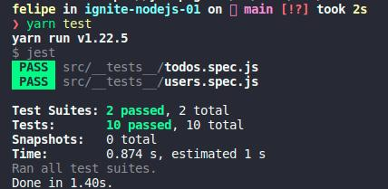

	

	<h1>Node.js Concepts</h1>

### Summary

- [About the challenge](#about-the-challenge)

- [Tests](#Tests)

### About the challenge

- An application to create users and manage todos. [Click here](https://github.com/felipejsborges/ignite-nodejs-01/commit/6db3ae60c0db26a031da2e88e66ff024d29dbc60) to see the implementation.

### Tests

 - **`should be able to create a new user`**
 
 - **`should not be able to create a new user when username already exists`**
 
 - **`should be able to list all user's todo`**
 
 - **`should be able to create a new todo`**
 
 - **`should be able to update a todo`**
 
 - **`should not be able to update a non existing todo`**
 
 - **`should be able to mark a todo as done`**
 
 - **`should not be able to mark a non existing todo as done`**
 
 - **`should be able to delete a todo`**
 
 - **`should not be able to delete a non existing todo`**
 

	
	

by Felipe Borges 
[LinkedIn](https://www.linkedin.com/in/felipejsborges) | [GitHub](https://github.com/felipejsborges)
